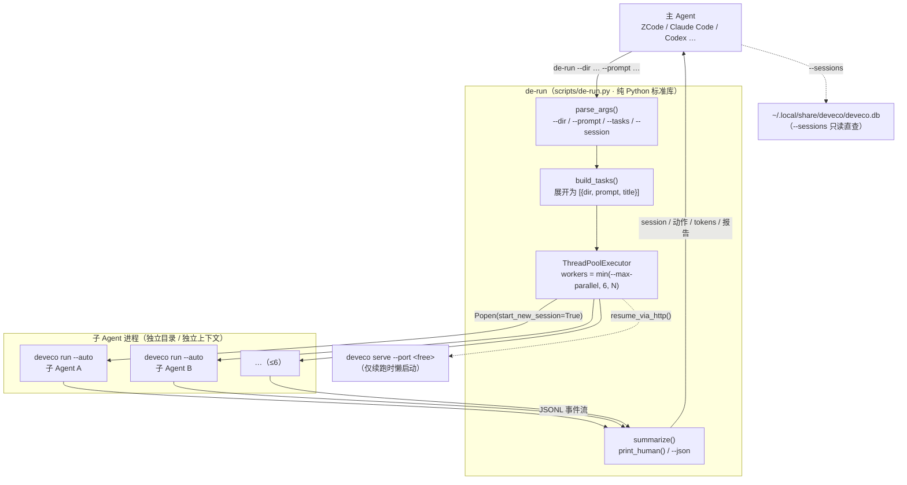
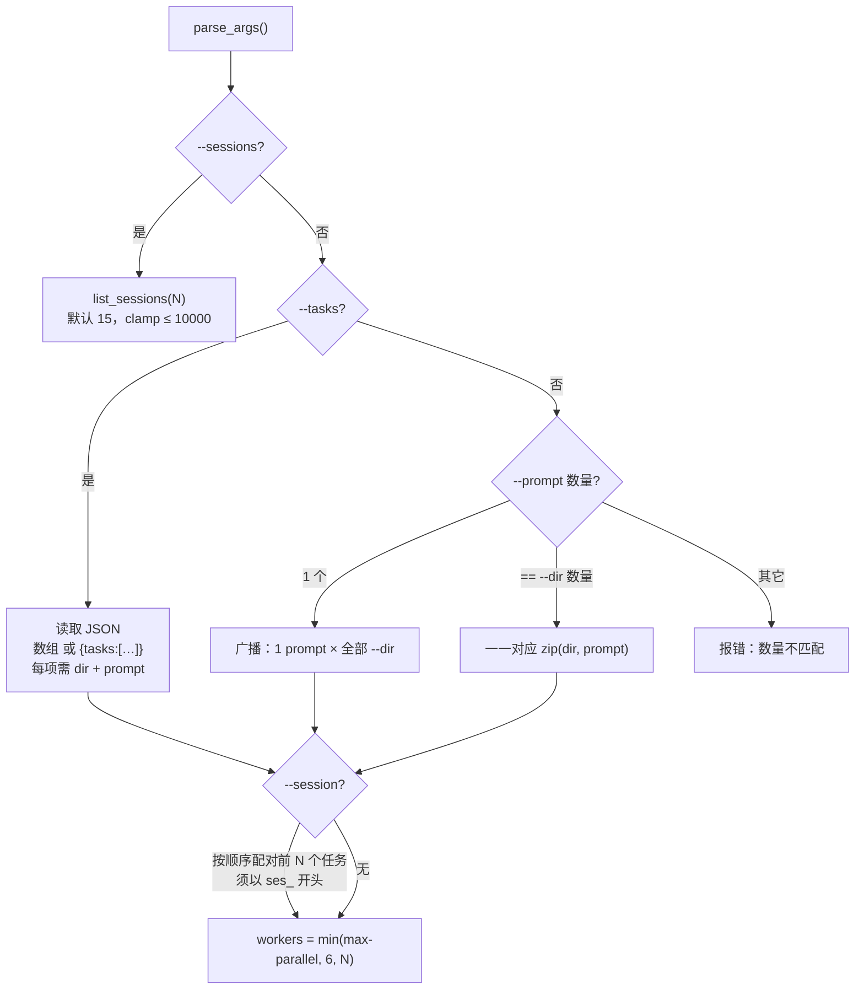
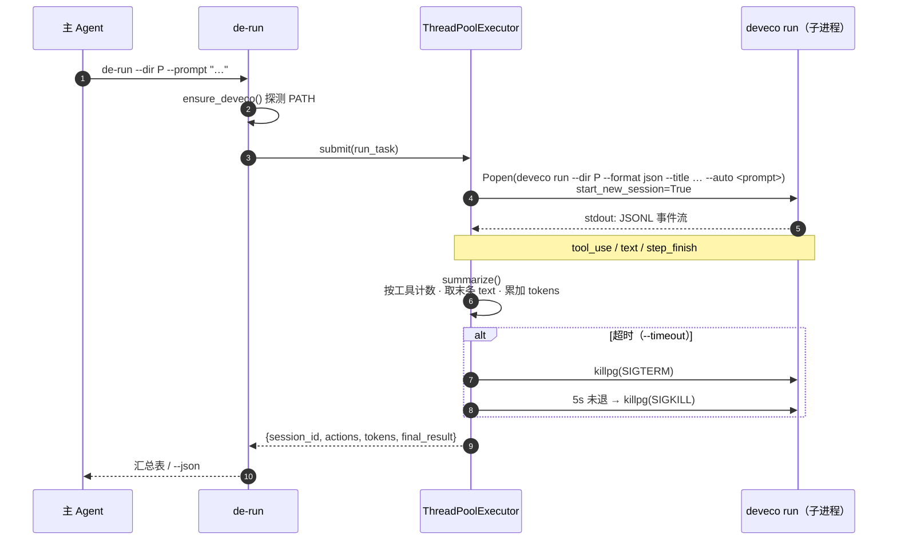
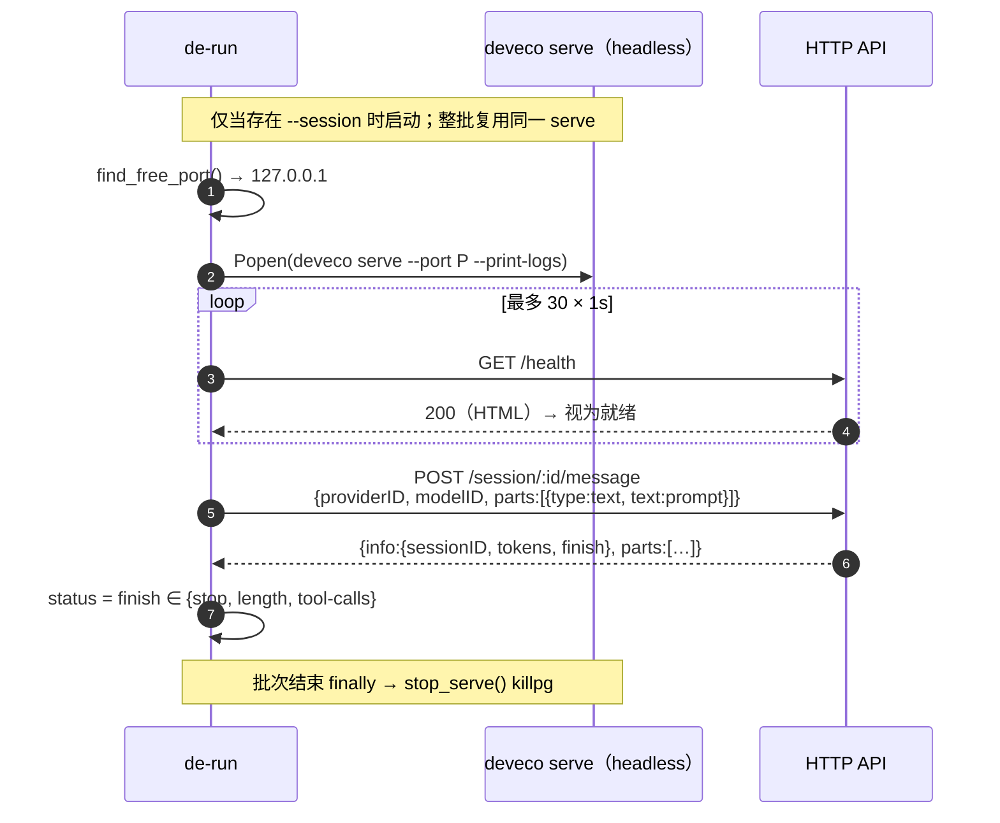
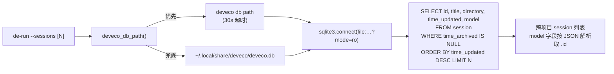
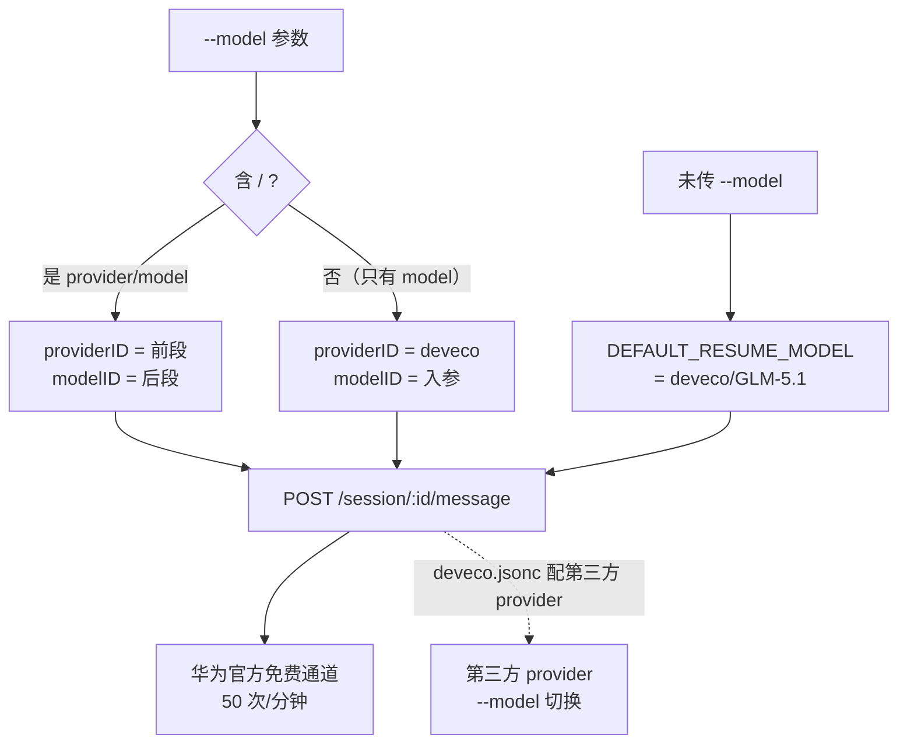

<div align="center">

> [English](./README_en.md) | **简体中文**


# de-run — 把华为 DevEco Code 变成任意 Harness 的子 Agent

**登录华为账号就有免费模型——主 Agent 负责指挥，deveco 子 Agent 负责干活，不花一分钱模型费。**

     

</div>

---

## 它解决什么问题

主 Agent 的大脑（上下文）是最昂贵的资源，但一个真实的工程任务里，**绝大部分 token 花在"读"上**：读几十万字的鸿蒙文档、通读一个陌生仓库、翻日志找线索。把这些活交给主 Agent 自己干，上下文分分钟被塞爆，后面的推理质量随之崩坏。

而原生 `deveco run` 只解决"跑一次"，不解决主 Agent 真正需要的三件事：**并行调度**、**结构化汇总**、**可靠的续跑**。

de-run 是一层薄薄的适配器，坐在主 Agent 和华为 DevEco Code（`deveco`）之间：

- 你给出若干「工作区目录 + 提示词」，它**并行派发**给独立子 Agent（≤6 个）；
- 子 Agent 的搜索、读码、思考都在**隔离上下文**里完成，读再多也不占你的脑容量；
- 全部结束后返回**结构化汇总**（session ID / 按工具统计的动作次数 / tokens / 最终报告）；
- `--session` 续跑同一个子 Agent，保持它的记忆，让你做**多轮主从迭代**。

底层是华为官方的 **DevEco Code（deveco）**——面向 HarmonyOS 开发的 AI Agent，基于 OpenCode 扩展。**登录华为账号即送免费 GLM-5.1 通道（单账号 50 次/分钟，无需自己的 API key）**，还内置鸿蒙官方开发能力：ArkTS 语法检查、HarmonyOS 离线文档、编译构建、真机/模拟器运行。

> **隐私与成本**：de-run 本身不联网、不采集任何数据，只做本地进程调度与结果汇总。模型请求发往华为官方通道（或你在 `deveco.jsonc` 里自配的 provider）。免费额度内，模型成本为零。

姊妹项目：[oc-run](https://github.com/RayMorTwinkle/oc-run)（把 OpenCode 1.x 当子 Agent，模型自由）、[oc-run2](https://github.com/RayMorTwinkle/oc-run2)（OpenCode 2 版）。三者用法完全一致，按需选用。

---

## ✨ 功能

- 🆓 **零成本模型**：登录华为账号即用免费 GLM-5.1，不用自己的 API key，不绑定付费供应商——「token 外包」这件事第一次真正免费
- 🎛️ **模型可换**：deveco 兼容 opencode 配置格式（`deveco.jsonc`），可接第三方 provider，`--model provider/model` 任意切
- ⚡ **并行派活**：一次最多 6 个子 Agent 同时干活，各自独立工作目录与提示词
- 📊 **自动汇总**：每个子 Agent 的 session ID、动作次数（按工具分组）、最终报告、tokens，一目了然
- 🔁 **可靠续跑**：`--session` 续跑同一子 Agent，保持它的记忆，按报告循环指挥直到达标（绕开 deveco 0.1.10 的 `--attach` / `--session` 缺陷，见下）
- 🔎 **跨项目历史**：`--sessions` 列出所有项目的 session（直读 deveco 的 SQLite）
- 🏗️ **鸿蒙官方工具链**：子 Agent 天然会 `arkts_check`、`build_project`、`start_app`、`hdc_log`、`verify_ui`（需 DevEco Studio ≥6.1，装在 `/Applications` 自动识别）
- 🧩 **任意环境可跑**：内置探测，PATH 精简环境（cron / 脚本 / Agent 子进程）也能找到 `deveco`
- 📦 **零依赖**：单个 Python 文件，纯标准库（`argparse` / `subprocess` / `concurrent.futures` / `sqlite3` / `urllib`），无第三方包

---

## 🚀 快速开始

### 方式一：面向 AI Agent（一键安装，推荐）

**把下面这段提示词直接复制给你的本地 AI Agent（ZCode / Claude Code / Codex 等），它就能自动完成安装：**

````markdown
请帮我安装 de-run skill（GitHub: https://github.com/RayMorTwinkle/de-run）。

背景：de-run 让任何主 Agent（ZCode/Claude Code/Codex 等）都能把本机的华为 DevEco Code（deveco）当子 Agent 指挥——并行派活、自动汇总报告、--session 续跑，且**登录华为账号即可免费用 GLM-5.1 模型，无需自己的 API key**。
它依赖本机已安装的 deveco CLI（npm i -g @deveco/deveco-code，需 Node.js 22+）、已完成 `deveco auth login`（华为账号登录，免费模型通道的前置条件）和 python3。

安装步骤：
1. 下载并解压（如果 ~/.agents/skills/de-run-subagent 已存在则先跳过，直接验证）：
   curl -L -o /tmp/de-run.zip https://github.com/RayMorTwinkle/de-run/archive/refs/heads/main.zip
   unzip -o /tmp/de-run.zip -d /tmp/ && mv /tmp/de-run-main ~/.agents/skills/de-run-subagent
   说明：~/.agents/skills/ 是多个 AI 工具共用的 skill 目录；如果你的平台用别的目录
   （如 Claude Code: ~/.claude/skills/，OpenCode: ~/.config/opencode/skills/），装到对应目录即可。
2. 验证 skill 结构：确认 ~/.agents/skills/de-run-subagent/SKILL.md 和 scripts/de-run.py 存在。
3. （可选但推荐）把 de-run 命令放进 PATH，方便直接调用：
   ln -sf ~/.agents/skills/de-run-subagent/scripts/de-run.py ~/.local/bin/de-run
4. 检查 deveco 环境：deveco --version 应输出版本号；deveco providers list 应显示已登录的华为账号凭据。
   若未安装 deveco，先 `npm i -g @deveco/deveco-code`（需 Node.js 22+）；
   若未登录，提示用户在自己的终端执行 `deveco auth login`（交互式华为账号登录）。
5. 验证命令：de-run --help 应输出中文使用说明；若 PATH 里没有，用 python3 ~/.agents/skills/de-run-subagent/scripts/de-run.py --help。
6. 端到端测试：de-run --sessions 3 应列出最近 3 个 session（跨所有项目）。
7. 向用户确认安装成功，并简述 de-run 的能力：并行派活 / 续跑（--session）/ 跨项目历史（--sessions）/
   免费 GLM-5.1（50 次/分钟）/ 鸿蒙开发能力（可选，需 DevEco Studio ≥6.1）。
````

### 方式二：面向人类用户

```bash
git clone https://github.com/RayMorTwinkle/de-run.git
# 或下载 zip: https://github.com/RayMorTwinkle/de-run/archive/refs/heads/main.zip
```

1. 安装 deveco 并登录：
   ```bash
   npm install -g @deveco/deveco-code   # 需 Node.js 22+
   deveco auth login                    # 华为账号登录（交互式，送免费 GLM-5.1）
   ```
2. 将 `de-run` 目录放入智能体的 skill 目录并**重命名为 `de-run-subagent`**（Claude Code: `~/.claude/skills/`；OpenCode: `~/.config/opencode/skills/`；通用共享: `~/.agents/skills/`）——skill 目录名须与 SKILL.md 的 `name` 一致
3. （可选）软链命令到 PATH：
   ```bash
   ln -s "$(pwd)/de-run/scripts/de-run.py" ~/.local/bin/de-run
   ```

> **环境要求**：macOS 或 Windows（deveco 目前无 Linux 版）、Python 3.9+、Node.js 22+（装 deveco 用）。`de-run` 本身零第三方依赖。鸿蒙编译能力另需 DevEco Studio ≥6.1。

---

## 🖥️ 使用

```bash
# 单个任务（阻塞执行，跑完输出汇总）
de-run --dir /path/to/project --prompt "分析这个项目的技术栈"

# 多个任务：工作目录与提示词一一对应（主用法，并行度默认 6、上限 6）
de-run --dir /path/A --prompt "分析项目A" --dir /path/B --prompt "分析项目B"

# 只给 1 个提示词 = 广播到所有目录
de-run --dir /path/A --dir /path/B --prompt "用中文简述这个项目"

# 批量任务文件（每任务自定义 dir / prompt / title）
de-run --tasks tasks.json   # [{"dir": "...", "prompt": "...", "title": "..."}, ...]

# 续跑：接着某个 session 的上下文继续跑
de-run --sessions                                  # 查看历史 session（跨所有项目）
de-run --dir /path/A --session ses_xxx --prompt "继续上次的分析"

# 模型切换（仅当你在 deveco.jsonc 配了第三方 provider 时）
de-run --dir /path/A --prompt "..." --model volcengine/glm-5.3

# 机器可读输出（给 LLM / 脚本消费）
de-run --dir /path/A --prompt "..." --json
```

### 参数一览

| 参数 | 说明 | 默认 |
|---|---|---|
| `--dir <path>` | 工作区目录，可重复指定 | — |
| `--prompt <text>` | 提示词，可重复；与 `--dir` **按出现顺序一一对应**；只给 1 个时**广播**到所有目录 | — |
| `--session <id>` | 续跑指定 session（可重复，须以 `ses_` 开头），按顺序配对前几个任务；不可与 `--tasks` 同用 | — |
| `--sessions [N]` | 列出最近 N 个 session（跨所有项目）后退出；`--json` 输出 JSON | `15`（clamp ≤ 10000） |
| `--tasks <file>` | 批量任务 JSON（数组，或 `{"tasks":[...]}`）；与 `--dir/--prompt` 二选一 | — |
| `--max-parallel <N>` | 最大并行数，**硬上限 6**，超出仅告警并按上限执行 | `6` |
| `--model <p/m>` | 指定模型，格式 `provider/model` | `deveco/GLM-5.1` |
| `--timeout <sec>` | 单任务超时秒数（超时按进程组 SIGTERM → 5s → SIGKILL 清理） | `900` |
| `--json` | 汇总输出为 JSON（含 `summary` 与逐任务 `tasks`） | 人类可读表格 |
| `--truncate <n>` | 人类可读输出中每条结果的最大字符数 | 不截断（全文） |

> **图片 / 文件输入**：读图或附带文件无需额外参数——把文件路径写进提示词，子 Agent 会自行读取；也可用 `deveco run` 原生 `-f/--file` 传附件。

<details>
<summary>📄 输出示例（人类可读）</summary>

```
de-run 汇总 · 2 个任务 · 并行度 2 · 成功 2/2
────────────────────────────────────────────────────────────────────────
✅ [1] projectA
    session: ses_f7c0ada77ffeCFuvNs5qigdgC6
    动作:   5 次 (glob×1 · grep×2 · read×2)
    tokens: 41,236
    结果:   该项目使用 Python 3.12 + FastAPI …

✅ [2] harmonyos-app
    session: ses_f7c0b1e9dffeKq2wMn8stCfWX
    动作:   9 次 (arkts_check×1 · build_project×2 · read×6)
    tokens: 88,914
    结果:   ArkTS 检查通过，已生成 HAP：build/default/outputs/default/entry-default-signed.hap

总耗时: 47.3s
```

</details>

---

## 🏗️ 架构

### 系统总览

主 Agent 通过 CLI 进入 de-run；任务被展开后交给线程池，每个任务是一个独立的 `deveco run` 子进程；结果统一汇总回主 Agent。`--session` 续跑时另行懒启动一个 headless `deveco serve`。



### 任务构建与广播逻辑

`build_tasks()` 是纯函数式的参数展开：`--tasks` 与 `--dir/--prompt` 互斥；`--prompt` 数量为 1 时广播，等于 `--dir` 数量时一一对应，其它情况直接报错。



### 单任务执行时序

每个任务都是一次 `deveco run --format json`，de-run 解析其 stdout 的 JSONL 事件流。超时按进程组清理，单个任务失败不影响其它任务。



### 续跑：`deveco serve` + HTTP API 时序

deveco 0.1.10 的 `deveco run --attach` 事件回传损坏、原生 `deveco run --session` 又会挂起。de-run 的续跑因此改走 `deveco serve` 的 HTTP API：批次内复用同一个 serve，就绪探测后 `POST /session/:id/message`。



> **失效安全**：`run_task()` 里任何异常都只会把该任务标记为 `error`（`_task_error()` 统一字段结构），不会中断整批；`stop_serve()` 在 `finally` 中执行，保证子进程不残留。

### `--sessions` 数据来源

deveco 的 `db` 子命令没有 JSON 输出，不易解析。de-run 于是**只读直查** deveco 的 SQLite，跨项目列出全部 session。



### 续跑时的模型 / provider 解析

`--model` 遵循 `provider/model` 约定；续跑时被拆成 `providerID` 与 `modelID` 放进 HTTP 请求体。



---

## 🏗️ 鸿蒙开发场景

deveco 是华为鸿蒙官方 AI Agent，子 Agent 继承其全部鸿蒙能力。给子 Agent 环境装好 [DevEco Studio](https://developer.huawei.com/consumer/cn/download/deveco-studio)（≥6.1；装在 `/Applications` 自动识别，或设 `DEVECO_HOME` 指向安装目录）后：

```bash
# 语法检查 + 修复 + 编译一条龙
de-run --dir /path/to/harmonyos-project --prompt "运行 ArkTS 语法检查并修复错误，然后编译出 HAP，回报产物路径"

# 并行审查多个模块
de-run --dir /path/A --prompt "审查这个模块的性能问题" --dir /path/B --prompt "审查这个模块的性能问题"

# 查鸿蒙文档（deveco 内置离线文档检索，免联网）
de-run --dir /path/to/project --prompt "搜索 deveco docs 里关于后台任务的指南并总结要点"
```

子 Agent 会自行调用 deveco 内置的 `arkts_check` / `build_project` / `start_app` / `hdc_log` / `verify_ui` 等工具，或使用 deveco 内嵌命令行（create/build/docs/skills/emulator 全套）。

---

## 🧠 推荐用法（给 LLM 的编排建议）

1. **token 外包（单轮）——大量读、简洁报**：派临时子 Agent 去读海量资料（网页/代码/文档），回报只要简洁结论 + 来源。子 Agent 独立上下文，读再多也不占你的上下文；GLM-5.1 免费，成本可忽略。
2. **主从循环（多轮）——强模型指挥弱模型**：用 `--session` 续跑同一子 Agent（保持记忆），按每次回报决定下一轮，循环直到结果达标。两条铁律：
   - 任务描述要详细：子 Agent 没有你的全局视野，prompt 就是它的世界
   - 回报格式要明确：你只能看到报告/最后发言——回报至少包含 **结论 + 来源 + 不确定性 + 未完成项 + 关键函数或举措**

两种用法均可并行（一次派多个，≤6）、可异步（借宿主环境如 ZCode / Claude Code 的后台任务机制，完成自动通知）。

---

## 📂 目录结构

```text
de-run/                      # 仓库名；作为 skill 安装时重命名为 de-run-subagent
├── SKILL.md                 # 面向 AI 智能体的 skill 定义（name: de-run-subagent）
├── README.md                # 简体中文说明文件（主文档）
├── README_en.md             # 英文说明文件
├── LICENSE                  # MIT
├── de-run.svg               # 图标（白环 + 三阶蓝速度线）
├── scripts/
│   └── de-run.py            # 主脚本（纯 Python 标准库，零依赖）
└── examples/
    └── tasks.example.json   # 批量任务文件模板
```

---

## 🔧 技术细节

**关键常量**（`scripts/de-run.py`）：

| 常量 | 值 | 含义 |
|---|---|---|
| `PROG` | `"de-run"` | 程序名（帮助/报错前缀） |
| `DEFAULT_MAX_PARALLEL` / `MAX_PARALLEL_LIMIT` | `6` / `6` | 默认并行度 / 硬上限 |
| `DEFAULT_TIMEOUT` | `900` | 单任务超时（秒） |
| `DEFAULT_RESUME_MODEL` | `"deveco/GLM-5.1"` | 续跑默认模型 |

**子 Agent 调用命令**（`run_task()` 拼装）：

```text
deveco run --dir <dir> --format json --title <title> --auto [--model <provider/model>] <prompt>
```

- `--auto` 自动批准权限（等价 opencode 的 `--dangerously-skip-permissions`）——只读分析类任务请勿让子 Agent 改文件。
- 子进程以 `start_new_session=True` 启动，超时用 `killpg(SIGTERM)` → 5s → `killpg(SIGKILL)` 清理整棵进程树。

**事件流 schema**（`summarize()` 解析 `deveco run --format json` 的 JSONL，**与 opencode 完全一致**）：

| 事件 `type` | 提取字段 | 用途 |
|---|---|---|
| 任意含 `sessionID` | `ev["sessionID"]` | 取首个出现的 session ID |
| `tool_use` | `part["tool"]` | 按工具名计数（`Counter`） |
| `text` | `part["text"]` | 收集文本，**末条**作为 `final_result` |
| `step_finish` | `part["tokens"]["total"]` | 累加为总 `tokens` |

任务 `status` 判定：`exit_code == 0` 且拿到 `session_id` → `ok`，否则 `failed`。

**汇总字段**（每个任务）：`title` / `dir` / `status` / `session_id` / `actions`（工具→次数）/ `total_actions` / `final_result` / `tokens` / `exit_code` / `stderr_tail`（stderr 末尾 500 字符）。

**续跑 HTTP 协议**（`resume_via_http()`）：

- 请求：`POST {serve_url}/session/{session_id}/message`，体为 `{"providerID":…, "modelID":…, "parts":[{"type":"text","text":prompt}]}`；
- 响应：`{"info": {"sessionID", "tokens", "finish"}, "parts": [...]}`；
- 成功判定：`info.sessionID` 存在且 `info.finish ∈ {stop, length, tool-calls}`。

**serve 生命周期**（`get_serve()` / `stop_serve()`）：懒启动、进程组独立、全局复用（`_serve_proc` / `_serve_url` / `_serve_lock`）；`serve` 中途崩溃会自动重置并在下次重启；就绪判定是 `GET /health` 返回 200（HTML 页），最多轮询 30 × 1s。

**`--sessions` SQL**：

```sql
SELECT id, title, directory, time_updated, model
FROM session
WHERE time_archived IS NULL
ORDER BY time_updated DESC
LIMIT N   -- clamp: max(0, min(N, 10000))
```

以只读 URI 打开：`sqlite3.connect(f"file:{db_path}?mode=ro", uri=True, timeout=10)`。`session.directory` 即工作目录（deveco.db 无 project/worktree 关联表，schema 与 opencode.db 不同）。

**`ensure_deveco()` 探测路径**：先 `shutil.which("deveco")`；落空则依次扫描 `~/.npm-global/bin`、`/opt/homebrew/bin`、`/usr/local/bin`、`~/.local/bin`、`~/.bun/bin`，命中后把该目录前置注入 `PATH`。`os.path.isfile()` 会自动过滤悬空软链。

**凭据位置**：`deveco auth login` 的凭据存于 `~/.local/share/deveco/auth.json`；未登录时 `deveco run` 直接失败。

**JSON 输出结构**（`--json`）：

```json
{
  "summary": {"total": 2, "parallel": 2, "ok": 2, "elapsed_sec": 47.3},
  "tasks": [{"title":"…","dir":"…","status":"ok","session_id":"ses_…",
             "actions":{"read":6,"grep":2},"total_actions":8,
             "final_result":"…","tokens":41236,"exit_code":0,"stderr_tail":""}]
}
```

**人类可读输出**：头部 `de-run 汇总 · N 个任务 · 并行度 W · 成功 X/N`，逐任务带状态图标（`ok` ✅ / `failed` ❌ / `timeout` ⏱ / `error` ⚠️）、session、按工具排序的动作统计、tokens、结果或错误摘要，结尾输出总耗时。

---

## ❓ 常见疑问

**为什么不用原生 `deveco run` 直接跑？**
原生命令只解决"跑一次"；de-run 补上三件主 Agent 真正需要的事：**上下文隔离**（子 Agent 读几十万 tokens 资料，你的上下文一滴不占）、**并行调度 + 结构化汇总**（一次派 6 个，统一收报告）、**绕开上游缺陷的可靠续跑**（见下）。

**"免费 GLM-5.1" 是怎么回事？**
deveco（DevEco Code）是华为官方工具，用华为账号登录后官方免费提供 GLM-5.1 模型通道，单账号限 50 次/分钟——这是官方通道，不需要你自己申请 API key 或充值。配额内完全零成本；需要更高吞吐时可在 `deveco.jsonc` 配置第三方 provider，再用 `--model` 切换。

**de-run 和 oc-run / oc-run2 什么关系？**

| | de-run | [oc-run](https://github.com/RayMorTwinkle/oc-run) | [oc-run2](https://github.com/RayMorTwinkle/oc-run2) |
|---|---|---|---|
| 底层子 Agent | 华为 DevEco Code（`deveco`） | OpenCode 1.x（`opencode`） | OpenCode 2 beta（`opencode2`） |
| 模型 | **华为账号免费 GLM-5.1**（50 次/分钟）+ 可换 | 模型自由（自带 provider） | 模型自由 + `--variant` |
| 鸿蒙工具链 | **内置**（ArkTS 检查/编译/真机） | 无 | 无 |
| 续跑 `--session` | `serve` + HTTP API 绕行 | `serve` + attach 绕行 | **原生支持** |
| `--sessions` | 只读直查 `deveco.db` SQLite | 直查 `opencode.db` | 官方 API |
| 花费统计 | 仅 tokens（免费无花费） | 无 | tokens + **cost（美元）** |
| CLI 接口 | 三者完全一致（命令名不同） | 同 | 同 |

三者可共存，按任务选工具：零成本外包 + 鸿蒙开发选 de-run；已有 opencode 配置、要任意模型选 oc-run / oc-run2。

**de-run、de-run-subagent、仓库名是什么关系？**
命令叫 `de-run`，skill 名叫 `de-run-subagent`（skill 目录名与 SKILL.md 的 `name` 一致），GitHub 仓库名 `de-run`。装好 skill 后，用命令、用 skill 触发都指向同一个工具。

**子 Agent 会乱改我的文件吗？**
`deveco run` 自动携带 `--auto`（自动批准权限），这是派活场景的默认需求。只读分析类任务请在提示词里明确约束（"只分析，不要修改任何文件"）。

**高并行会互相干扰吗？**
每个任务独立进程、独立目录、独立 session；但 `deveco serve`（仅续跑时）是批次内共享的。免费通道限 50 次/分钟，高并发批量建议 `--max-parallel 2~3`。

---

## ⚠️ 已知限制

- **deveco 0.1.10 的 `run --attach` 事件回传损坏**（回复已生成但事件流只吐 `step_start`）：de-run 的续跑改为 `deveco serve` + HTTP API 直连（`POST /session/:id/message`），已实测稳定；deveco 后续版本修复后不受影响
- **原生 `deveco run --session` 非交互续跑会挂起**：de-run 不使用该路径
- **卡死 / spinning 的 deveco TUI 会阻塞 `deveco serve` 启动**（占用 SQLite 锁）：批量派活前先关掉卡住的 deveco 交互窗口
- **免费通道限速**：50 次/分钟/账号，高并发批量建议 `--max-parallel 2~3`
- **平台**：deveco 目前提供 macOS（Apple Silicon / Intel）与 Windows 版本，暂无 Linux
- **`deveco db` 无 JSON 输出**：de-run 的 `--sessions` 因此直接以只读方式查询 `~/.local/share/deveco/deveco.db`

---

## 📄 License

MIT

---

## 🙏 致谢 / Credits

- 底层能力来自华为官方的 **DevEco Code（`deveco`）** 与 **DevEco Studio**，本项目不修改其本体，仅做本地调度适配。
- `scripts/de-run.py` 由姊妹项目 **[oc-run](https://github.com/RayMorTwinkle/oc-run)**（opencode → deveco）移植而来，事件流 schema 与 opencode 一致——这也是为什么三兄弟的 CLI 接口能保持完全统一。
- 图标、README（中英双语）与架构图为本项目自制。

---

<div align="center">
<sub>de-run · 主 Agent 动嘴，deveco 动手，华为账号买单</sub>
</div>
