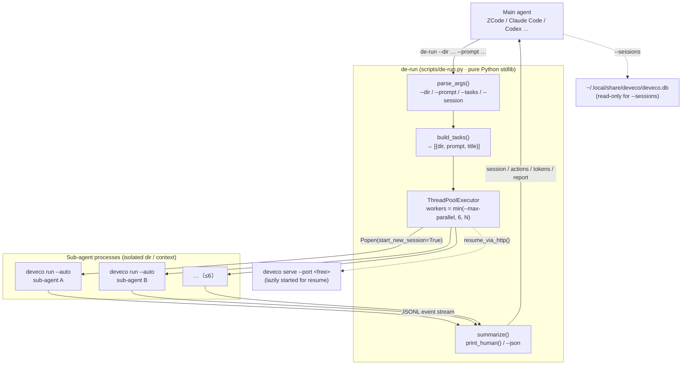
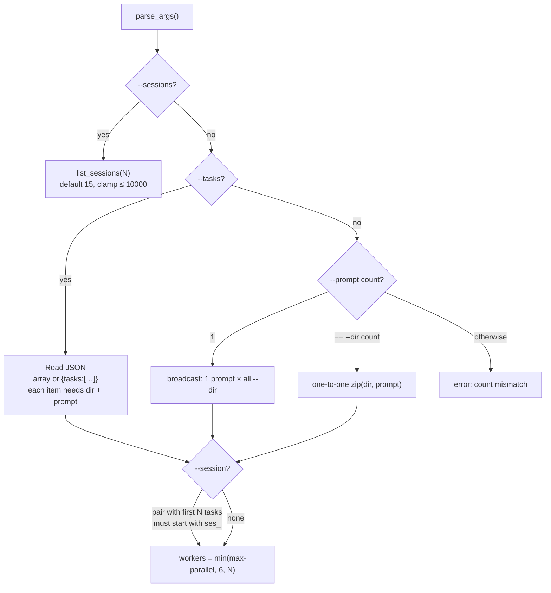
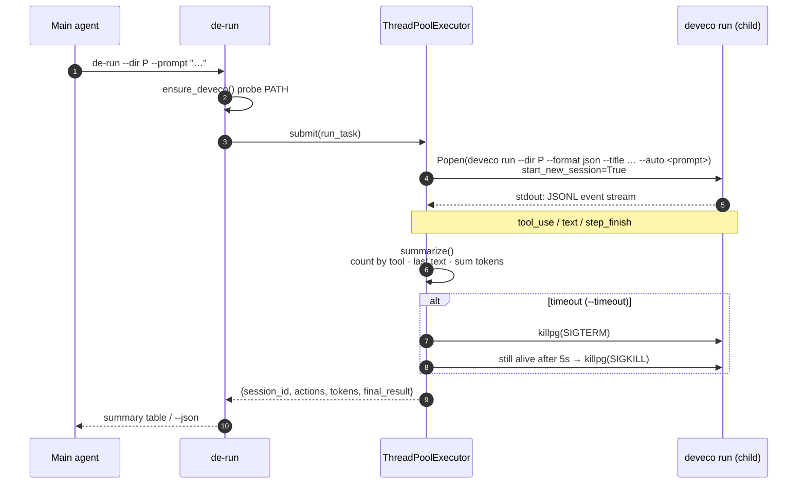
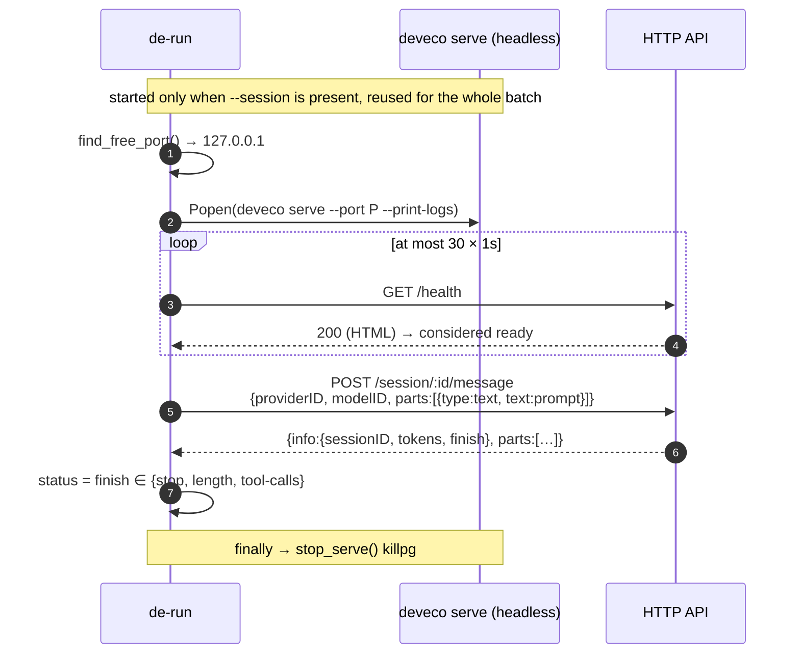
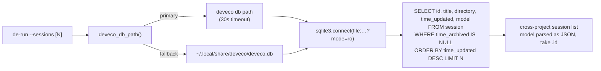
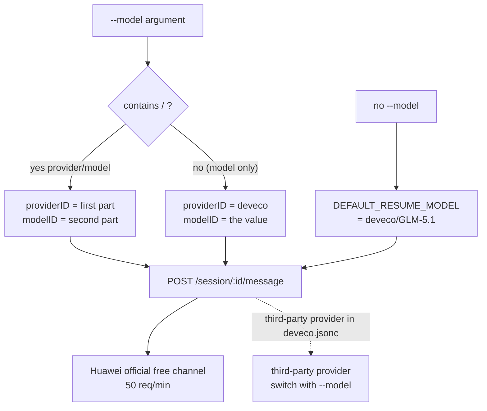

<div align="center">

> **English** | [简体中文](./README.md)


# de-run — Turn Huawei DevEco Code into a Sub-Agent for Any Harness

**A free model channel just for signing in — your main agent commands, deveco sub-agents do the work, at zero model cost.**

     

</div>

---

## Why it exists

A main agent's brain (its context window) is its most expensive resource, yet in real engineering work **most tokens are spent on "reading"**: devouring hundreds of thousands of tokens of HarmonyOS docs, getting through an unfamiliar repository, grepping logs for a clue. Do that in your own context and it blows up within minutes, tanking the quality of everything that follows.

Native `deveco run` only solves "run once"; it doesn't give a main agent the three things it actually needs: **parallel scheduling**, **structured summaries**, and **reliable resume**.

de-run is a thin adapter sitting between your main agent and Huawei DevEco Code (`deveco`):

- You hand it a set of "working directory + prompt" tasks; it **dispatches them in parallel** to independent sub-agents (up to 6).
- Each sub-agent's searching, code reading and thinking happen in an **isolated context** — none of it touches your brain.
- When everything finishes it returns a **structured summary** (session ID / per-tool action counts / tokens / final report).
- `--session` resumes the same sub-agent with its memory intact, enabling **multi-round master–slave iteration**.

Under the hood is **DevEco Code (deveco)** — Huawei's official AI coding agent for HarmonyOS, extended from OpenCode. **Signing in with a Huawei account unlocks a free GLM-5.1 channel (50 requests/min per account, no API key of your own required)**, plus the official HarmonyOS toolchain: ArkTS syntax checking, offline HarmonyOS docs, build & run on devices/emulators.

> **Privacy & cost**: de-run itself never goes online and collects no data — it only schedules local processes and aggregates results. Model requests go to Huawei's official channel (or a provider you configure in `deveco.jsonc`). Within the free quota, model cost is zero.

Sibling projects: [oc-run](https://github.com/RayMorTwinkle/oc-run) (OpenCode 1.x as sub-agents, model freedom) and [oc-run2](https://github.com/RayMorTwinkle/oc-run2) (OpenCode 2). All three share an identical CLI interface — pick whichever fits the task.

---

## ✨ Highlights

- 🆓 **Zero-cost model**: free GLM-5.1 after Huawei account sign-in, no API key, no paid vendor — "token outsourcing" is finally actually free
- 🎛️ **Swappable models**: deveco accepts opencode-style config (`deveco.jsonc`); switch with `--model provider/model`
- ⚡ **Parallel dispatch**: up to 6 sub-agents working simultaneously, each with its own working directory and prompt
- 📊 **Auto summary**: session ID, per-tool action counts, final report and tokens per sub-agent
- 🔁 **Reliable resume**: `--session` continues the same sub-agent with memory intact, looping until the report is good enough (works around deveco 0.1.10's `--attach` / `--session` defects — see below)
- 🔎 **Cross-project history**: `--sessions` lists sessions from all projects (reads deveco's SQLite directly)
- 🏗️ **Official HarmonyOS toolchain**: sub-agents natively use `arkts_check`, `build_project`, `start_app`, `hdc_log`, `verify_ui` (requires DevEco Studio ≥6.1; auto-detected when installed under `/Applications`)
- 🧩 **Runs anywhere**: built-in binary discovery works even with a minimal PATH (cron / scripts / agent subprocesses)
- 📦 **Zero dependencies**: a single Python file, pure standard library (`argparse` / `subprocess` / `concurrent.futures` / `sqlite3` / `urllib`), no third-party packages

---

## 🚀 Quick start

### Option 1: For AI agents (one-shot install, recommended)

**Paste this prompt into your local AI agent (ZCode / Claude Code / Codex etc.) and it will handle everything:**

````markdown
Please install the de-run skill (GitHub: https://github.com/RayMorTwinkle/de-run).

Background: de-run lets any main agent (ZCode/Claude Code/Codex etc.) use the local Huawei DevEco Code (deveco) as a sub-agent — parallel dispatch, auto summaries, --session resume, and **a free GLM-5.1 model channel just for signing in with a Huawei account (no API key needed)**.
Prerequisites: deveco CLI installed (npm i -g @deveco/deveco-code, requires Node.js 22+), `deveco auth login` completed, and python3.

Steps:
1. Download and extract (skip if ~/.agents/skills/de-run-subagent already exists, then just verify):
   curl -L -o /tmp/de-run.zip https://github.com/RayMorTwinkle/de-run/archive/refs/heads/main.zip
   unzip -o /tmp/de-run.zip -d /tmp/ && mv /tmp/de-run-main ~/.agents/skills/de-run-subagent
   Note: ~/.agents/skills/ is a shared skill directory; use your platform's directory if different
   (Claude Code: ~/.claude/skills/, OpenCode: ~/.config/opencode/skills/, etc.).
2. Verify skill layout: ~/.agents/skills/de-run-subagent/SKILL.md and scripts/de-run.py exist.
3. (Optional but recommended) symlink the command into PATH:
   ln -sf ~/.agents/skills/de-run-subagent/scripts/de-run.py ~/.local/bin/de-run
4. Check deveco: `deveco --version` prints a version; `deveco providers list` shows the Huawei credential.
   If missing, install with `npm i -g @deveco/deveco-code` (Node.js 22+);
   if not signed in, ask the user to run `deveco auth login` in their own terminal (interactive).
5. Verify: de-run --help prints a Chinese usage guide; otherwise use python3 ~/.agents/skills/de-run-subagent/scripts/de-run.py --help.
6. Smoke test: de-run --sessions 3 lists the 3 most recent sessions across projects.
7. Confirm success and summarize capabilities: parallel dispatch / resume (--session) /
   cross-project history (--sessions) / free GLM-5.1 (50 req/min) / HarmonyOS tooling (optional).
````

### Option 2: For humans

```bash
git clone https://github.com/RayMorTwinkle/de-run.git
# or: https://github.com/RayMorTwinkle/de-run/archive/refs/heads/main.zip
```

1. Install deveco and sign in:
   ```bash
   npm install -g @deveco/deveco-code   # requires Node.js 22+
   deveco auth login                    # Huawei account (interactive; unlocks free GLM-5.1)
   ```
2. Put the `de-run` directory into your agent's skill directory and **rename it to `de-run-subagent`** (Claude Code: `~/.claude/skills/`; OpenCode: `~/.config/opencode/skills/`; shared: `~/.agents/skills/`) — the directory name must match the `name` in SKILL.md
3. (Optional) symlink into PATH:
   ```bash
   ln -s "$(pwd)/de-run/scripts/de-run.py" ~/.local/bin/de-run
   ```

> **Requirements**: macOS or Windows (deveco has no Linux build yet), Python 3.9+, Node.js 22+ (to install deveco). `de-run` itself has zero third-party dependencies. HarmonyOS build capability additionally needs DevEco Studio ≥6.1.

---

## 🖥️ Usage

```bash
# Single task (blocking, prints a summary when done)
de-run --dir /path/to/project --prompt "Analyze this project's tech stack"

# Multiple tasks: directories and prompts pair one-to-one (main usage; default parallelism 6, cap 6)
de-run --dir /path/A --prompt "Analyze project A" --dir /path/B --prompt "Analyze project B"

# A single prompt is broadcast to all directories
de-run --dir /path/A --dir /path/B --prompt "Summarize this project in English"

# Batch task file (custom dir / prompt / title per task)
de-run --tasks tasks.json   # [{"dir": "...", "prompt": "...", "title": "..."}, ...]

# Resume: continue a session with its memory
de-run --sessions                                  # list recent sessions (across projects)
de-run --dir /path/A --session ses_xxx --prompt "Continue the previous analysis"

# Model switch (only when you configured a third-party provider in deveco.jsonc)
de-run --dir /path/A --prompt "..." --model volcengine/glm-5.3

# Machine-readable output (for LLMs / scripts)
de-run --dir /path/A --prompt "..." --json
```

### Options

| Option | Description | Default |
|---|---|---|
| `--dir <path>` | Working directory; repeatable | — |
| `--prompt <text>` | Prompt; repeatable. Pairs **one-to-one by order** with `--dir`; a single prompt is **broadcast** to all dirs | — |
| `--session <id>` | Resume a session (repeatable, must start with `ses_`), paired with the first N tasks by order; cannot be combined with `--tasks` | — |
| `--sessions [N]` | List the N most recent sessions across projects, then exit; `--json` emits JSON | `15` (clamped ≤ 10000) |
| `--tasks <file>` | Batch task JSON (array, or `{"tasks":[...]}`); mutually exclusive with `--dir/--prompt` | — |
| `--max-parallel <N>` | Max parallelism, **hard cap 6**; exceeding it only warns and runs at the cap | `6` |
| `--model <p/m>` | Model in `provider/model` form | `deveco/GLM-5.1` |
| `--timeout <sec>` | Per-task timeout (on timeout the process group gets SIGTERM → 5s → SIGKILL) | `900` |
| `--json` | Emit the summary as JSON (with `summary` and per-task `tasks`) | human-readable table |
| `--truncate <n>` | Max characters per result in the human-readable output | no truncation (full) |

> **Images / file input**: no extra flag needed — put the file path in the prompt and the sub-agent will read it; you can also pass attachments via `deveco run`'s native `-f/--file`.

<details>
<summary>📄 Sample output (human-readable)</summary>

```
de-run summary · 2 tasks · parallel 2 · ok 2/2
────────────────────────────────────────────────────────────────────────
✅ [1] projectA
    session: ses_f7c0ada77ffeCFuvNs5qigdgC6
    actions: 5 (glob×1 · grep×2 · read×2)
    tokens:  41,236
    result:  This project uses Python 3.12 + FastAPI …

✅ [2] harmonyos-app
    session: ses_f7c0b1e9dffeKq2wMn8stCfWX
    actions: 9 (arkts_check×1 · build_project×2 · read×6)
    tokens:  88,914
    result:  ArkTS check passed; HAP produced: build/default/outputs/default/entry-default-signed.hap

Total elapsed: 47.3s
```

</details>

---

## 🏗️ Architecture

### System overview

The main agent enters through the CLI; tasks are expanded and handed to a thread pool; each task is an independent `deveco run` subprocess; results are aggregated back to the main agent. For `--session` resume, a headless `deveco serve` is lazily started separately.



### Task construction & broadcast logic

`build_tasks()` is a pure parameter expansion: `--tasks` is mutually exclusive with `--dir/--prompt`; one `--prompt` broadcasts, a count equal to `--dir` pairs one-to-one, anything else errors out.



### Single-task execution sequence

Each task is one `deveco run --format json`; de-run parses the JSONL event stream on its stdout. Timeouts clean up the whole process group, and a failing task never affects the others.



### Resume: `deveco serve` + HTTP API sequence

deveco 0.1.10's `deveco run --attach` has a broken event relay and native `deveco run --session` hangs. de-run's resume therefore goes through `deveco serve`'s HTTP API: one serve is reused for the whole batch, and after a readiness probe it issues `POST /session/:id/message`.



> **Fail-safe**: inside `run_task()` any exception only marks that one task `error` (a uniform field shape from `_task_error()`), never aborting the batch; `stop_serve()` runs in `finally` so no child process is left behind.

### `--sessions` data source

deveco's `db` subcommand has no JSON output, so it's awkward to parse. de-run instead opens deveco's SQLite **read-only** and lists every session across projects.



### Model / provider parsing for resume

`--model` follows the `provider/model` convention; on resume it is split into `providerID` and `modelID` in the HTTP request body.



---

## 🏗️ HarmonyOS development

Sub-agents inherit deveco's full HarmonyOS capabilities. Install [DevEco Studio](https://developer.huawei.com/consumer/cn/download/deveco-studio) (≥6.1; auto-detected under `/Applications`, or set `DEVECO_HOME` to the install directory), then:

```bash
# Syntax check + fix + build in one shot
de-run --dir /path/to/harmonyos-project --prompt "Run ArkTS syntax check, fix errors, build a HAP, report the artifact path"

# Parallel module reviews
de-run --dir /path/A --prompt "Review this module for performance issues" --dir /path/B --prompt "Review this module for performance issues"

# Query HarmonyOS docs (deveco's built-in offline doc search, no network needed)
de-run --dir /path/to/project --prompt "Search deveco docs for the background-tasks guide and summarize the key points"
```

Sub-agents will call deveco's built-in `arkts_check` / `build_project` / `start_app` / `hdc_log` / `verify_ui` tools, or use deveco's embedded CLI (create/build/docs/skills/emulator).

---

## 🧠 Orchestration tips (for LLMs)

1. **Token outsourcing (single round) — read a lot, report briefly**: dispatch throwaway sub-agents to digest massive material (docs/code/logs); ask for concise conclusions + sources. Their context is isolated; GLM-5.1 is free, so cost is a non-issue.
2. **Master–slave loop (multi-round) — strong model commands weak model**: resume the same sub-agent with `--session`, iterate on its report until done. Two iron rules:
   - Be detailed: the sub-agent has no view of your world; the prompt is its entire world
   - Demand a format: conclusions + sources + uncertainties + unfinished items + key functions

Both patterns work in parallel (≤6) and asynchronously (via your harness's background task mechanism).

---

## 📂 Project layout

```text
de-run/                      # repo name; rename to de-run-subagent when installing as a skill
├── SKILL.md                 # agent-facing skill definition (name: de-run-subagent)
├── README.md                # Chinese readme (primary)
├── README_en.md             # English readme
├── LICENSE                  # MIT
├── de-run.svg               # icon (white ring + three-stage blue speed lines)
├── scripts/
│   └── de-run.py            # main script (pure Python stdlib, zero deps)
└── examples/
    └── tasks.example.json   # batch task file template
```

---

## 🔧 Technical notes

**Key constants** (`scripts/de-run.py`):

| Constant | Value | Meaning |
|---|---|---|
| `PROG` | `"de-run"` | program name (help/error prefix) |
| `DEFAULT_MAX_PARALLEL` / `MAX_PARALLEL_LIMIT` | `6` / `6` | default parallelism / hard cap |
| `DEFAULT_TIMEOUT` | `900` | per-task timeout (seconds) |
| `DEFAULT_RESUME_MODEL` | `"deveco/GLM-5.1"` | default model for resume |

**Sub-agent command** (assembled in `run_task()`):

```text
deveco run --dir <dir> --format json --title <title> --auto [--model <provider/model>] <prompt>
```

- `--auto` auto-approves permissions (equivalent to opencode's `--dangerously-skip-permissions`) — don't let read-only analysis tasks modify files.
- The child starts with `start_new_session=True`; on timeout it is cleaned up as a whole process tree via `killpg(SIGTERM)` → 5s → `killpg(SIGKILL)`.

**Event stream schema** (`summarize()` parses `deveco run --format json`'s JSONL; **identical to opencode's**):

| Event `type` | Field extracted | Use |
|---|---|---|
| any with `sessionID` | `ev["sessionID"]` | take the first session ID seen |
| `tool_use` | `part["tool"]` | count by tool name (`Counter`) |
| `text` | `part["text"]` | collect text; the **last** entry becomes `final_result` |
| `step_finish` | `part["tokens"]["total"]` | accumulate into total `tokens` |

Task `status`: `exit_code == 0` and a `session_id` present → `ok`, otherwise `failed`.

**Summary fields** (per task): `title` / `dir` / `status` / `session_id` / `actions` (tool → count) / `total_actions` / `final_result` / `tokens` / `exit_code` / `stderr_tail` (last 500 chars of stderr).

**Resume HTTP protocol** (`resume_via_http()`):

- Request: `POST {serve_url}/session/{session_id}/message` with body `{"providerID":…, "modelID":…, "parts":[{"type":"text","text":prompt}]}`;
- Response: `{"info": {"sessionID", "tokens", "finish"}, "parts": [...]}`;
- Success: `info.sessionID` present and `info.finish ∈ {stop, length, tool-calls}`.

**serve lifecycle** (`get_serve()` / `stop_serve()`): lazily started, own process group, reused globally (`_serve_proc` / `_serve_url` / `_serve_lock`); a crashed serve is detected and restarted on the next call; readiness is `GET /health` returning 200 (an HTML page), polled at most 30 × 1s.

**`--sessions` SQL**:

```sql
SELECT id, title, directory, time_updated, model
FROM session
WHERE time_archived IS NULL
ORDER BY time_updated DESC
LIMIT N   -- clamp: max(0, min(N, 10000))
```

Opened read-only: `sqlite3.connect(f"file:{db_path}?mode=ro", uri=True, timeout=10)`. `session.directory` is the working directory (deveco.db has no project/worktree relation table — its schema differs from opencode.db).

**`ensure_deveco()` probe paths**: first `shutil.which("deveco")`; if that fails, it scans `~/.npm-global/bin`, `/opt/homebrew/bin`, `/usr/local/bin`, `~/.local/bin`, `~/.bun/bin` in order, and prepends the hit directory to `PATH`. `os.path.isfile()` automatically filters dangling symlinks.

**Credential location**: `deveco auth login` stores credentials at `~/.local/share/deveco/auth.json`; without sign-in, `deveco run` fails outright.

**JSON output structure** (`--json`):

```json
{
  "summary": {"total": 2, "parallel": 2, "ok": 2, "elapsed_sec": 47.3},
  "tasks": [{"title":"…","dir":"…","status":"ok","session_id":"ses_…",
             "actions":{"read":6,"grep":2},"total_actions":8,
             "final_result":"…","tokens":41236,"exit_code":0,"stderr_tail":""}]
}
```

**Human-readable output**: header `de-run summary · N tasks · parallel W · ok X/N`, then per task the status icon (`ok` ✅ / `failed` ❌ / `timeout` ⏱ / `error` ⚠️), session, tool actions sorted by name, tokens, and the result or error excerpt, ending with total elapsed time.

---

## ❓ FAQ

**Why not just use native `deveco run`?**
The native command only "runs once". de-run adds what a main agent actually needs: **context isolation** (sub-agents read hundreds of thousands of tokens; yours stays clean), **parallel dispatch + structured summaries** (dispatch 6 at once, collect one report), and **reliable resume that works around upstream defects** (see below).

**What's the deal with "free GLM-5.1"?**
deveco is Huawei's official tool; signing in with a Huawei account unlocks an official free GLM-5.1 channel (50 req/min/account). No API key, no billing. Need more throughput? Configure third-party providers in `deveco.jsonc` and switch with `--model`.

**How does de-run relate to oc-run / oc-run2?**

| | de-run | [oc-run](https://github.com/RayMorTwinkle/oc-run) | [oc-run2](https://github.com/RayMorTwinkle/oc-run2) |
|---|---|---|---|
| Underlying sub-agent | Huawei DevEco Code (`deveco`) | OpenCode 1.x (`opencode`) | OpenCode 2 beta (`opencode2`) |
| Model | **free GLM-5.1 via Huawei account** (50 req/min) + swappable | model freedom (own providers) | model freedom + `--variant` |
| HarmonyOS toolchain | **built in** (ArkTS check/build/device) | no | no |
| Resume `--session` | `serve` + HTTP API workaround | `serve` + attach workaround | **native** |
| `--sessions` | read-only query of `deveco.db` SQLite | queries `opencode.db` | official API |
| Cost reporting | tokens only (free ⇒ no cost) | none | tokens + **cost (USD)** |
| CLI interface | identical across all three (command name differs) | same | same |

All three coexist; pick per task: zero-cost outsourcing + HarmonyOS work → de-run; existing opencode config / any model wanted → oc-run / oc-run2.

**Naming?**
Command: `de-run`. Skill name: `de-run-subagent` (directory must match SKILL.md `name`). Repo: `de-run`.

**Will sub-agents modify my files?**
`deveco run` carries `--auto` (auto-approve permissions), which is the default need for dispatch. For read-only analysis, constrain the prompt explicitly ("analyze only, do not modify any files").

**Does high parallelism interfere?**
Each task has an independent process, directory and session; but `deveco serve` (resume only) is shared within a batch. The free channel is limited to 50 req/min, so for heavy batches use `--max-parallel 2~3`.

---

## ⚠️ Known limitations

- **deveco 0.1.10's `run --attach` has a broken event relay** (replies are generated but only `step_start` reaches the client): de-run resumes via `deveco serve` + HTTP API (`POST /session/:id/message`) instead — verified stable; unaffected once deveco fixes it
- **Native `deveco run --session` hangs on non-interactive resume**: not used by de-run
- **A stuck/spinning deveco TUI blocks new `deveco serve` instances** (SQLite lock): close it before batch runs
- **Free tier rate limit**: 50 req/min/account; use `--max-parallel 2~3` for heavy batches
- **Platforms**: deveco ships for macOS (Apple Silicon / Intel) and Windows; no Linux build yet
- **`deveco db` has no JSON output**: de-run's `--sessions` therefore queries `~/.local/share/deveco/deveco.db` read-only

---

## 📄 License

MIT

---

## 🙏 Credits

- Underlying capabilities come from Huawei's official **DevEco Code (`deveco`)** and **DevEco Studio**; this project does not modify them — it only adapts local scheduling.
- `scripts/de-run.py` was ported from the sibling project **[oc-run](https://github.com/RayMorTwinkle/oc-run)** (opencode → deveco); the event stream schema is identical to opencode's — which is why the three siblings keep a fully unified CLI interface.
- The icon, README (bilingual) and architecture diagrams are original to this project.

---

<div align="center">
<sub>de-run · your main agent talks, deveco works, Huawei pays the model bill</sub>
</div>
